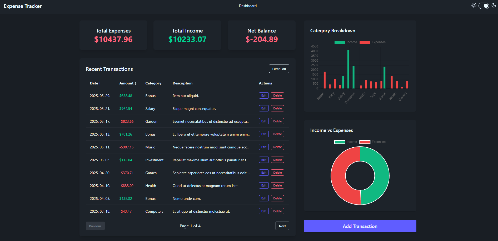
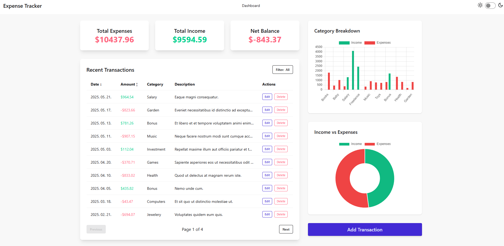
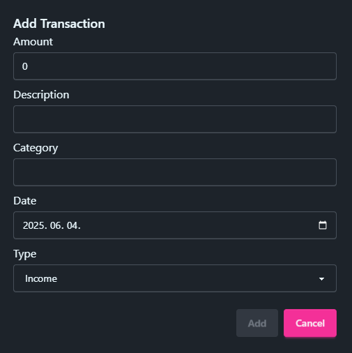
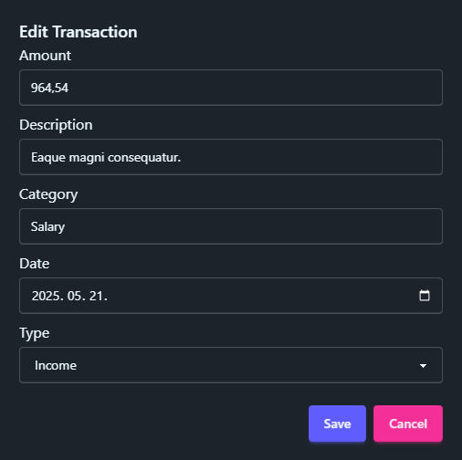

# 💰 Expense Tracker

    

A full-stack expense tracking application with a Vue.js frontend and .NET 8 backend to help you manage your personal finances efficiently.

## 📋 Project Overview

Expense Tracker is a comprehensive web application designed to help users track their personal finances. Users can:

- Add income and expense transactions
- Categorize financial activities
- View financial summaries
- Analyze spending patterns through intuitive visualizations
- Filter transactions by time periods

## 🏗️ Project Structure

This repository contains two main components:

- **ExpenseVue**: Frontend application built with Vue.js
- **ExpenseApi**: Backend API built with .NET 8

## 🚀 Technologies Used

### Frontend (ExpenseVue) 🎨

- ⚡ Vue.js 3 with Composition API
- 📝 TypeScript for type safety
- 📊 Chart.js for data visualization
- 🔄 Axios for API communication
- 🎨 Tailwind CSS & DaisyUI for styling
- 🛠️ Vite as the build tool

### Backend (ExpenseApi) 🖥️

- 🔷 .NET 8.0
- 🗃️ Entity Framework Core
- 🐬 MySQL database
- 📚 Swagger for API documentation
- 🔒 DotNetEnv for environment variables

## ⚙️ Installation & Setup

### Prerequisites

- Node.js (v16+)
- .NET SDK 8.0+
- MySQL Server
- Git

### Clone the Repository

```bash
git clone https://github.com/yourusername/Expense-Tracker.git
cd Expense-Tracker
```

### Backend Setup 🖥️

1. Navigate to the API project directory:

```bash
cd ExpenseApi/ExpenseApi
```

2. Install EF Core CLI tools (if not already installed):

```bash
dotnet tool install --global dotnet-ef
```

3. Create a MySQL database named `expensetracker`

4. Configure your database connection:

   Create a `.env` file in the `ExpenseApi/ExpenseApi` directory with:

   ```
   ConnectionStrings__ExpenseDbContext=Server=localhost;Database=expensetracker;Uid=YOUR_USERNAME;Pwd=YOUR_PASSWORD;
   ```

   **Note:** The application is configured to read database connection settings from `.env` files. User Secrets is also supported as an alternative for development environments.

5. Apply database migrations:

```bash
dotnet ef database update
```

6. Start the API:

```bash
dotnet run
```

The API will be available at:

- API: http://localhost:5113/api
- Swagger UI: http://localhost:5113/swagger

### Frontend Setup 🎨

1. Navigate to the frontend directory:

```bash
cd ExpenseVue
```

2. Install dependencies:

```bash
npm install
```

3. Create a `.env` file:

```bash
cp .env.example .env
```

4. Start the development server:

```bash
npm run dev
```

The application will be available at http://localhost:5173

## 📱 Features

- 💵 Track expenses and income
- 🏷️ Categorize transactions
- 📅 Filter transactions by time period (day, month, year)
- 📊 Visualize spending patterns with charts
- 📱 Responsive design for mobile and desktop
- 🔒 Secure storage of sensitive configuration data

## 🔄 API Configuration

### How Frontend Connects to Backend

The frontend is configured to connect to the backend through Vite's proxy:

1. During development, API requests are proxied from the frontend to the backend:

   - Frontend makes requests to `/api/*`
   - Vite's development server proxies these requests to `http://localhost:5113`
   - No need to manually set the API URL in most cases

2. For production or custom setups:
   - You can set `VITE_API_URL` in your `.env` file to override the default proxy setup
   - Example: `VITE_API_URL=http://localhost:5113/api` or your production API URL

### API Endpoints

| Method | Endpoint               | Description              |
| ------ | ---------------------- | ------------------------ |
| GET    | /api/transactions      | Get all transactions     |
| GET    | /api/transactions/{id} | Get transaction by ID    |
| POST   | /api/transactions      | Create a new transaction |
| PUT    | /api/transactions/{id} | Update a transaction     |
| DELETE | /api/transactions/{id} | Delete a transaction     |

## 📁 Project Structure

### Backend Structure

- `Controllers/` - API endpoint controllers
- `Data/` - Database context and configuration
- `Models/` - Domain models
- `Services/` - Business logic services
- `Migrations/` - EF Core migrations

### Frontend Structure

- `src/` - Source code
  - `api/` - API integration code
  - `assets/` - Static assets
  - `components/` - Vue components
  - `services/` - Business logic services
  - `types/` - TypeScript type definitions
  - `utils/` - Utility functions

## 📸 Screenshots

### Dashboard View




### Transaction Management




## Author

- **Name**: Raczkó Dávid
- **Email**: [raczkodavid@gmail.com](mailto:raczko.david@gmail.com)
